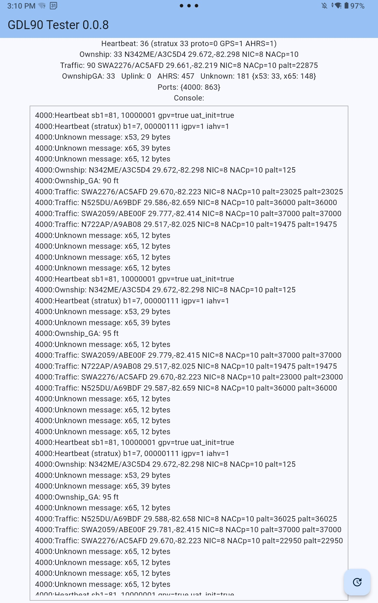

# gdl90
A minimal GDL90 (over WiFi) tester using selected AvareX code (thanks ZK) as a base, with additional decoding and instrumentation.
I use on Android (mostly) as a simple, portable, stand-alone app to assert GDL90 compliance,
help out Avare* forum users, diagnose my non-compliant new Dynon HDX &nbsp; :-( &nbsp; , etc.

#### Installing
You will have to "side-load" the (latest) .apk from this page (0.0.8 is current).  If that's not something you understand or
are comfortable with, then I can't help you with additional support.  [This information](https://www.apps4av.com/manual-installation.html) from Avare* may help.

#### Usage Hints
The "refresh" button at the bottom right flushes the console queue to control scrolling, etc.
That console window is scrollable, but doesn't (yet?) update until you click the refresh button (do it often).

The example screenshot below (against stratux v1.6r1-eu027) shows various GDL90 message counts at the top,
plus more per-message detail in the Console by port (4000 in this case):  
* Heartbeat shows 36 messages of standard GDL90 Heartbeat and 33 of the [stratux-identifying Heatbeat](https://github.com/cyoung/stratux/blob/master/notes/app-vendor-integration.md) plus some bit decoding)  
* Ownship shows 33 messages, decoded as N342ME/mode-S plus lat/long and integrity bit decoding
* 90 Traffic messages, latest target is SWA2276 with pressure altitude
* Unknown shows 33 pmessages of type 0x53 which is a non-standard GDL90 message the tester is currently not decoding, such as:
   * 0x53 is "second stratux status" msg [(SX message](https://github.com/cyoung/stratux/blob/36b504555408fb90dd5cf1171d4f91f99571e50c/main/gen_gdl90.go#L466), from Hilton software)
   * 0x65 is stratux ForeFlight "ID Message" (see [stratux GDL message code](https://github.com/cyoung/stratux/blob/36b504555408fb90dd5cf1171d4f91f99571e50c/main/gen_gdl90.go#L656), [ForeFlight links](https://www.foreflight.com/connect/spec/) below)
* Counts by port: AvareX 4000, 43211, 49002, 5557 (as of 0.55) plus 8384 for proprietary Dynon msgs (in-progress alpha)
   


#### AvareX Decoding
[storage.dart](https://github.com/apps4av/avarex/blob/9536d1bf661e9e314d6a7e91a864fcf4be8755da/lib/storage.dart#L186) listens on ports 4000, 43211, 49002, 5557  
message_factory.dart [message types defined](https://github.com/apps4av/avarex/blob/9536d1bf661e9e314d6a7e91a864fcf4be8755da/lib/gdl90/message_factory.dart#L98)
and [processed](https://github.com/apps4av/avarex/blob/9536d1bf661e9e314d6a7e91a864fcf4be8755da/lib/gdl90/message_factory.dart#L26) (after reception, or ignored):  
```
  Hex  Message                  Process?
  0x00 heartBeat                no
  0xCC stratux Heartbeat        no, but PR submitted for PFD roll-orientation reversal
  0x07 uplink                   yes
  0x0A ownShip                  yes
  0x0B ownShipGeometricAltitude yes
  0x14 trafficReport            yes
  0x1E basicReport              no
  0x1F longReport               no
  0x4C ahrsReport               yes
  0x7A deviceReport             no
```
#### stratux and GPS fix scenarios
stratux encodes the GPS fix state but only in the stratux-specific HeartBeat (0xCC) message in byte1 bit 1
(along with AHRS enabled bit 0) -- but NOT in the GDL90 Heartbeat message status byte 1 bit 7
[per the spec](https://www.faa.gov/sites/faa.gov/files/air_traffic/technology/adsb/archival/GDL90_Public_ICD_RevA.PDF)! (see p. 10).
If the stratux has no GPS fix, only the 0xCC msg will reflect this, along with no Ownship msg with position every second (1 Hz).

The GDL90 spec allows a GPS fix of 0,0 to be sent (see section 3.4 p. 16) and this along with NIC=0 is supposed to signify an invalid fix, although at
least AvareX ignores this scenario and assumes 0,0 is valid without checking NIC or HeartBeats(s), etc.  stratux is also non-compliant and does
not use the 0x00 msg bit and just stops sending Ownship (spec says send ownship but 0,0 and NIC=0 means invalid).  Either I misunderstand the spec
or many hardware/software implementors are out of spec.

#### Dynon HDX
Using my tester I confirmed that my new Dynon Skyview HDX is not GDL90-compliant: the tester confirms the HDX sends no Heartbeat or Ownship messages!
These issues have been [reported by me and others](https://forum.flydynon.com/threads/ads-b-over-wifi.15650/page-2#post-92735)
and I've discussed with Dynon over tickets and in-person, but no traction yet for Dynon to shore up basic GDL90 standard compliance.
Frankly, I'm surprised (and disappointed) that Dynon with their reputation isn't GDL90 standard compliant.

#### Platform
I wanted a stand-alone tool for Android (my use case, and occasionally Windows), so I decided to use
the multi-platform Flutter framework (despite the extra multi-platform overhead)
since that's what AvareX uses and I was already developing some code contributions
for AvareX (Nexrad/layer opacity/sliders, TFRs fix after FAA change, bug fixes, etc.).
Perhaps this instrumentation/diagnostic code will work back into AvareX at some point, if ZK allows it...

#### References
GDL90 spec: https://www.faa.gov/sites/faa.gov/files/air_traffic/technology/adsb/archival/GDL90_Public_ICD_RevA.PDF  
ForeFlight extensions: https://www.foreflight.com/connect/spec/  
stratux identifying Heartbeat, etc.: https://github.com/cyoung/stratux/blob/master/notes/app-vendor-integration.md  
stratux GDL90-ish message code: https://github.com/cyoung/stratux/blob/master/main/gen_gdl90.go#L629  
Dynon issues reported: https://forum.flydynon.com/threads/ads-b-over-wifi.15650/page-2#post-92735  
